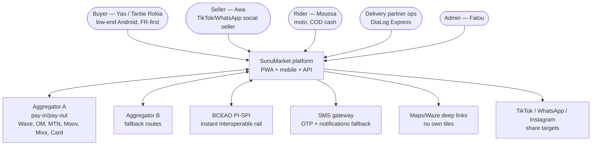
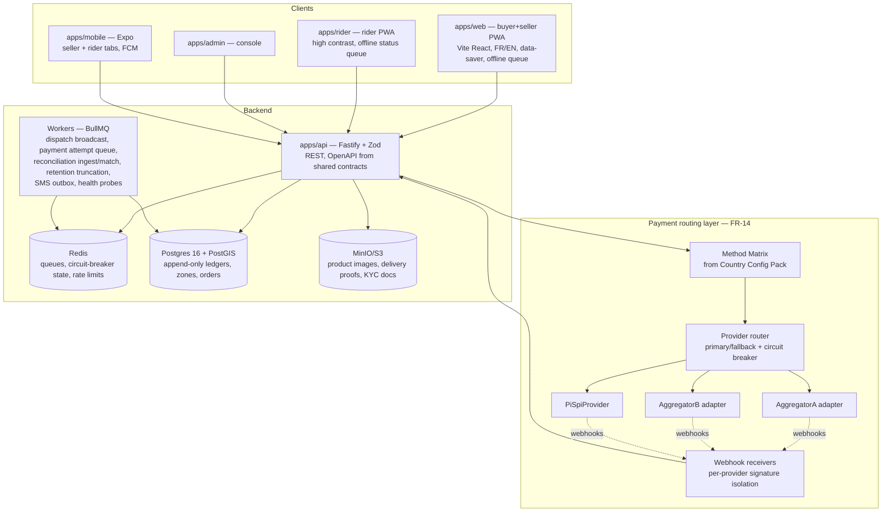
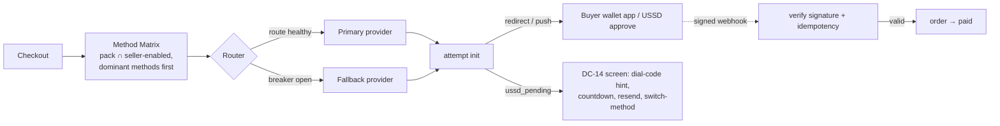
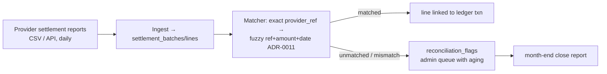

# SunuMarket — Architecture (C4)

Phase 1 deliverable. Product authority: `GOAL_PROMPT_SunuMarket.md` v3.0.

## C1 — System context

Money never rests inside SunuMarket (DC-10): all pay-in/pay-out flows through licensed
aggregators / e-money issuers / PI-SPI participants. SunuMarket is a technical intermediary.

## C2 — Containers

`packages/shared` carries the pure domain core (Money, order/dispatch state machines,
routing + circuit breaker, ledger engine, reconciliation matcher, geo fee engine, Zod
contracts); `packages/config` carries versioned Country Config Packs (FR-49). Adapters are
thin and config-selected; mocks ship first (Playbook rule 0.5).

## Payment routing (FR-13/14, DC-14)

Circuit breaker per (provider, method): opens after N consecutive failures/timeouts
(≤60 s detection, NFR-2), half-open probe, closes on success. Every attempt records the
provider that served it (settlement reconciliation needs this).

## Reconciliation worker (FR-19b)

## Cross-cutting

- **Idempotency:** client-supplied idempotency keys on order/attempt creation; webhook
  events deduplicated by (provider, event_id); replays are no-ops (ADR-0012).
- **Fraud (DC-8):** `paid` only via verified webhook/PI-SPI confirm; device binding +
  new-device re-verify; velocity rules feed `fraud_events` → admin anomaly queue.
- **Privacy:** GPS points consent-gated, encrypted at rest, coordinates truncated after
  retention window (FR-25); phone-first identity; export/delete endpoints.
- **Offline:** PWA queues (order+pin capture, rider status) sync idempotently; SMS fallback
  for no-data users (DC-15).
