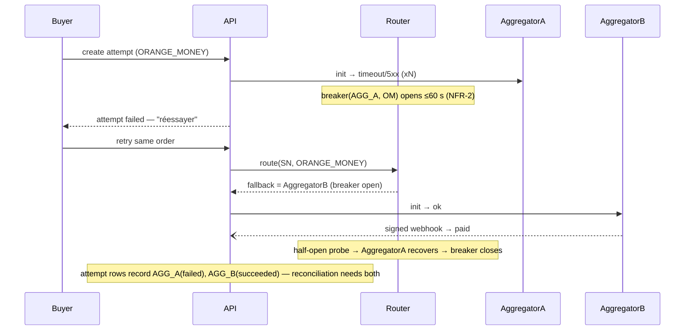
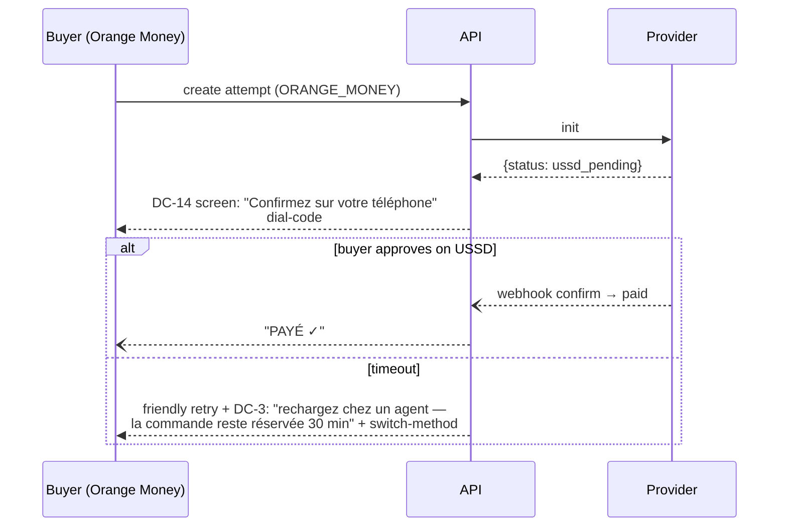
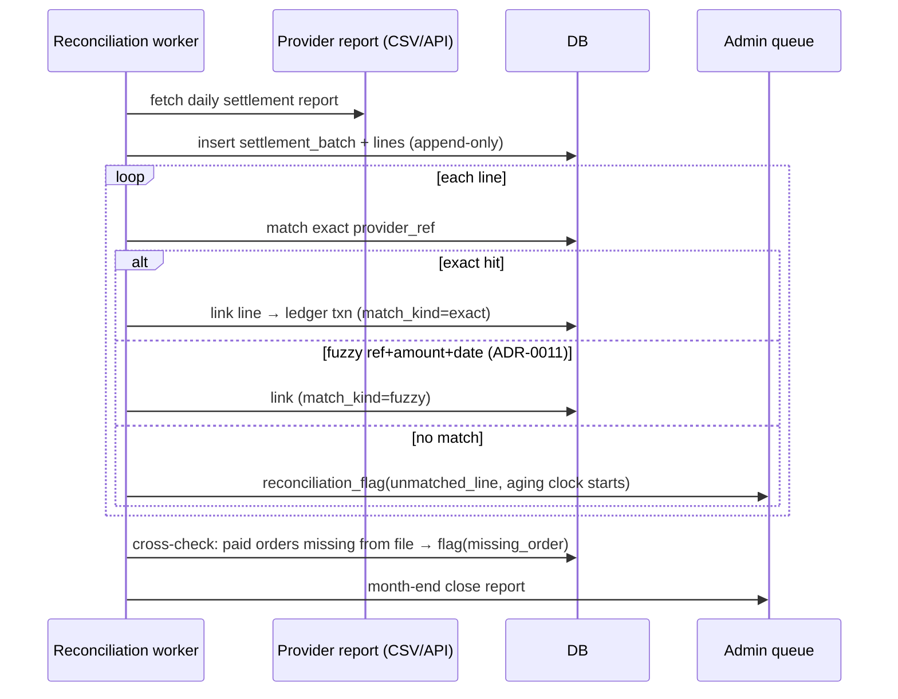
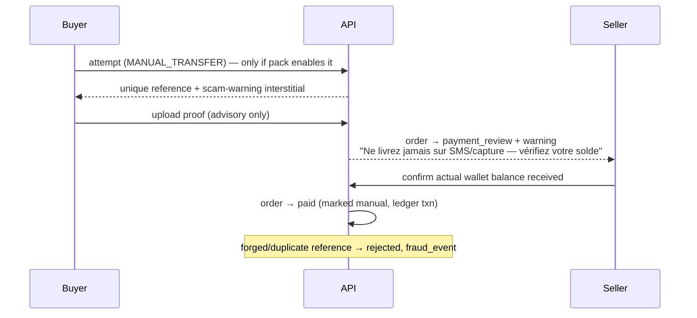

# SunuMarket — Sequence diagrams (Phase 1)

## 1. Webhook confirm (canonical paid path — DC-8.1)

```mermaid
sequenceDiagram
    participant B as Buyer
    participant API
    participant R as Router
    participant P as Provider (primary)
    B->>API: POST /orders/{id}/attempts {method, idempotency_key}
    API->>R: route(country, method)
    R-->>API: provider = primary (breaker closed)
    API->>P: init(attempt)
    P-->>API: {provider_ref, next: redirect|push}
    API-->>B: attempt initiated
    P--)API: POST /webhooks/{provider} (signed)
    API->>API: verify signature (per-provider secret)
    API->>API: dedupe (provider, event_id)
    API->>API: attempt → succeeded; order → paid; ledger txn (gross/fee/tax/net)
    API--)B: push/SMS "PAYÉ"
    Note over API: replayed webhook → outcome=duplicate, no state change
```

## 2. Failover mid-checkout (golden path 9, part 1)



## 3. USSD-pending confirm (DC-14, Tantie Rokia variant of golden path 10)



## 4. PI-SPI pay + payout (golden path 10)

```mermaid
sequenceDiagram
    participant B as Buyer (any wallet)
    participant API
    participant PS as PI-SPI
    participant S as Seller
    B->>API: create attempt (PI_SPI)
    API->>PS: create alias/QR request
    PS-->>API: {alias, qr}
    B->>PS: pays from any participating wallet/bank app
    PS--)API: instant confirmation (<10 s)
    API->>API: order → paid; ledger txn
    Note over API,S: later — payout run
    API->>PS: instant transfer to seller alias (rail=PI_SPI)
    PS-->>API: settled
    API->>API: payout ledger txn; fallback = aggregator payout if PI-SPI down
```

## 5. Settlement ingest & match (FR-19b, golden path 9 part 2)



## 6. Manual-transfer review (FR-15, DC-8.2 — pack-gated, default OFF)



## 7. Rider broadcast / first-accept (FR-26)

```mermaid
sequenceDiagram
    participant S as Seller
    participant API
    participant R1 as Rider 1..n
    participant B as Buyer
    S->>API: request delivery (mode=RIDER)
    API->>R1: broadcast dispatch_offers (zone-filtered)
    R1->>API: accept (first wins — race-protected)
    API-->>R1: job assigned; others → expired
    Note over API: no accept in T → re-broadcast wider → escalate PARTNER/SELF
    R1->>API: status flow: picked_up → en_route → arrived (GPS snapshots, offline queue)
    R1->>API: proof: photo or buyer OTP code
    API->>API: job → delivered; order → delivered
    API--)B: tracking updates (token link, SMS fallback)
```

## 8. COD remittance (FR-34b)

```mermaid
sequenceDiagram
    participant R as Rider (Moussa)
    participant API
    participant PS as PI-SPI
    R->>API: deliver COD order — proof gated
    API->>API: rider_cash_ledger += collected(total)
    Note over R: Σcollected − Σremitted = outstanding (cap per KYC tier 2)
    alt PI-SPI remittance
        R->>API: remit outstanding
        API->>PS: instant transfer rider→platform/seller
        PS-->>API: settled
        API->>API: rider_cash_ledger += remitted; seller ledger credited
    else agent cash deposit
        API-->>R: guidance: nearest agent deposit + reference
    end
    Note over API: counterfeit-cash education card shown once at rider onboarding (DC-8.4)
```
